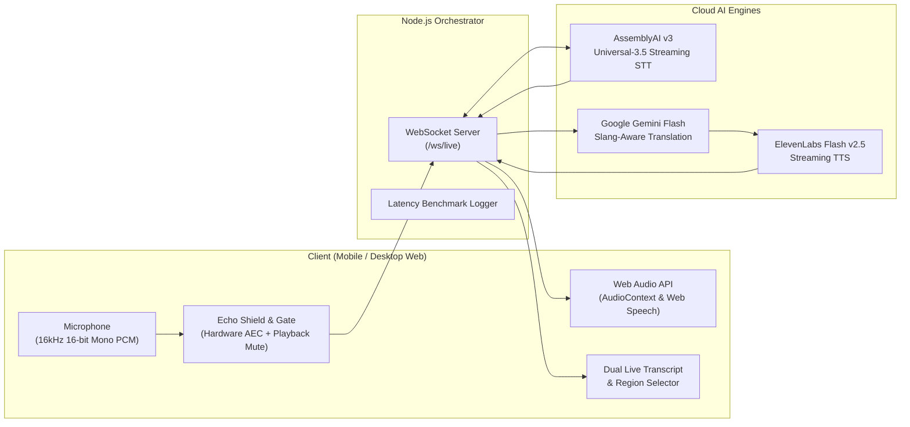

# Duet — Slang-Aware Live Voice Translation Web App

> Low-latency, natural-speech, slang-preserving translation for personal calls between English and Spanish speakers.

---

## The Core Value Proposition

Enterprise interpretation solutions (KUDO, Wordly, Interprefy) are designed for formal, structured conference speech and actively stumble or sanitize regional Latin American Spanish. **Duet** addresses the personal/family conversation gap by treating regional slang (*Mexican güey/neta/chido*, *Peruvian pata/asumare*, *Argentinian che/boludo*, *Colombian parce/chimba*) as a first-class citizen.

---

## Architecture Overview



---

## Key Features

1. **Standalone Conversational Web App**: Operates on a single shared device between two speakers with zero extensions or app store installations required.
2. **Sub-2-Second Pipeline**: Direct streaming pipeline with millisecond timestamp logging at each stage.
3. **Regional Nuance Tuning**: Instant dropdown for Mexican, Peruvian, Argentinian, Colombian, Caribbean, and Peninsular Spanish.
4. **Acoustic Feedback Shield**: Browser hardware AEC (`echoCancellation`, `noiseSuppression`) coupled with software audio gating so the speaker's translated audio never loops back into the microphone.
5. **Fail-Safe Voice Output**: Supports ElevenLabs Flash v2.5 streaming TTS with seamless client-side Web Speech Synthesis fallback.

---

## Project Structure

```
LiveTranslator/
├── .gitignore                     # Protects credentials and secrets
├── Dockerfile                     # Production Google Cloud Run container
├── README.md                      # Architecture and setup guide
├── PHASE_1_REPORT.md              # Phase 1 delivery report & benchmarks
├── package.json                   # Root workspace orchestration
└── prototype/
    ├── Dockerfile                 # Standalone prototype container
    ├── .env.example               # Template environment variables
    ├── backend/
    │   ├── package.json           # Backend dependencies
    │   ├── server.js              # Express + WebSocket orchestrator
    │   ├── assemblyai_client.js   # AssemblyAI v3 streaming client
    │   ├── translate.js           # Gemini Flash slang translation engine
    │   ├── tts_client.js          # ElevenLabs Flash v2.5 TTS client
    │   └── test_pipeline.js       # Pipeline verification script
    └── frontend/
        ├── index.html             # Responsive mobile-first interface
        ├── style.css              # Dark-mode styling and animations
        └── app.js                 # PCM audio capture & playback engine
```

---

## Quick Start (Local Development)

### 1. Prerequisites
- Node.js 20+ (Node.js v24 recommended)
- API Keys: AssemblyAI, Google Gemini, ElevenLabs

### 2. Setup Configuration
Copy `.env.example` to `.env` in the `prototype/` directory:
```bash
cp prototype/.env.example prototype/.env
```
Fill in your API credentials:
```env
PORT=8080
ASSEMBLYAI_API_KEY=your_assemblyai_api_key
GEMINI_API_KEY=your_gemini_api_key
ELEVENLABS_API_KEY=your_elevenlabs_api_key
```

### 3. Install & Run
```bash
# Install backend dependencies
cd prototype/backend
npm install

# Start local server
npm start
```
Open [http://localhost:8080](http://localhost:8080) in your browser.

---

## Google Cloud Run Deployment

Deploy directly to Google Cloud Run:

```bash
# 1. Set Google Cloud project
gcloud config set project YOUR_PROJECT_ID

# 2. Build and deploy container
gcloud run deploy duet-translator \
  --source . \
  --platform managed \
  --region us-central1 \
  --allow-unauthenticated \
  --set-env-vars ASSEMBLYAI_API_KEY=your_key,GEMINI_API_KEY=your_key,ELEVENLABS_API_KEY=your_key \
  --session-affinity
```

> **Note**: `--session-affinity` ensures WebSocket connections remain connected to the same Cloud Run instance throughout a conversation turn.
